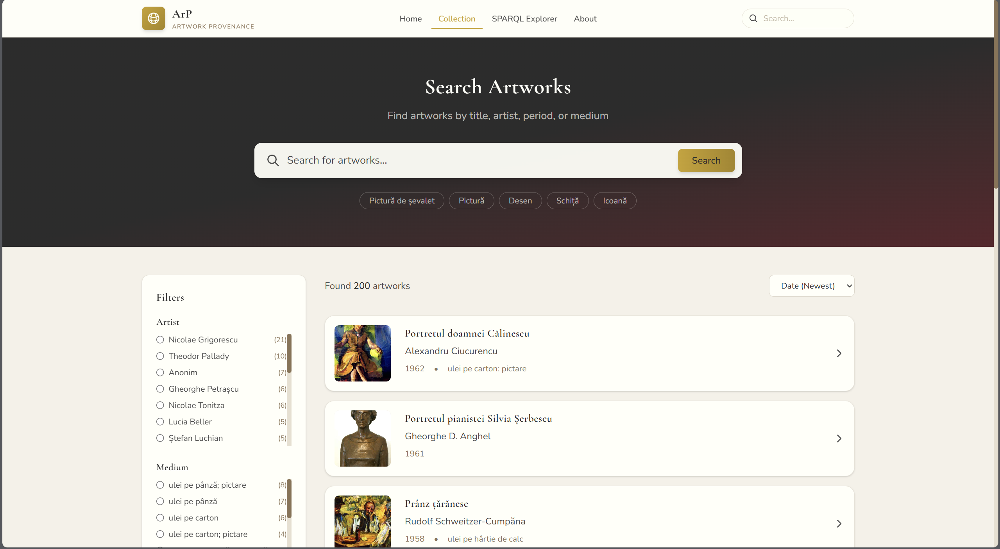
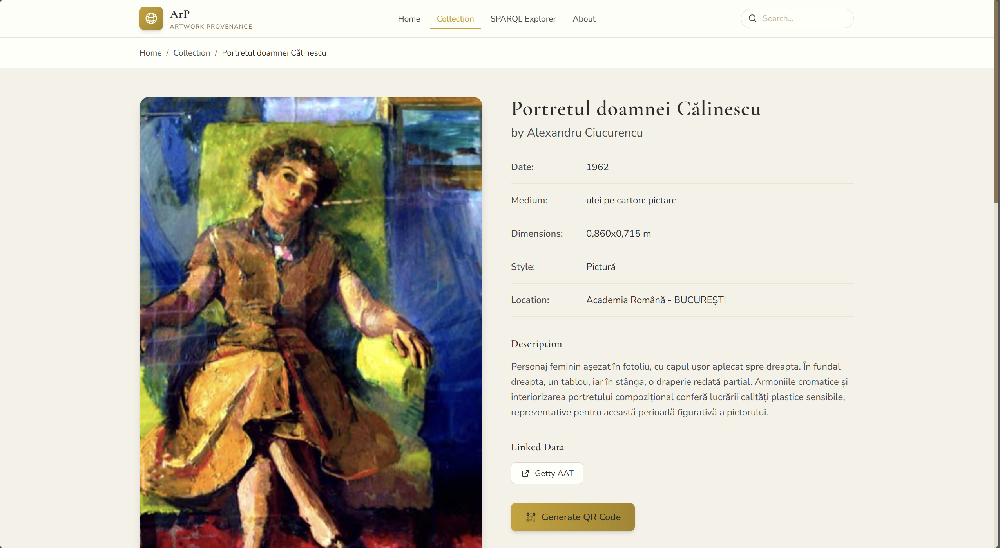
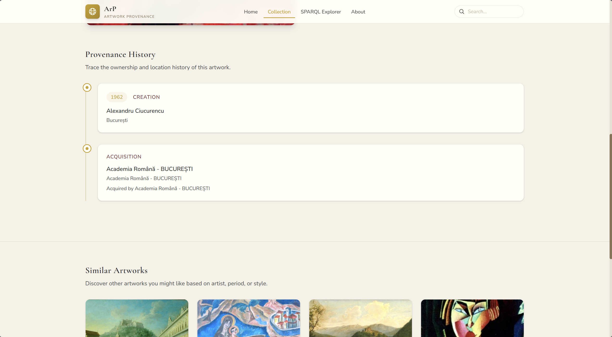
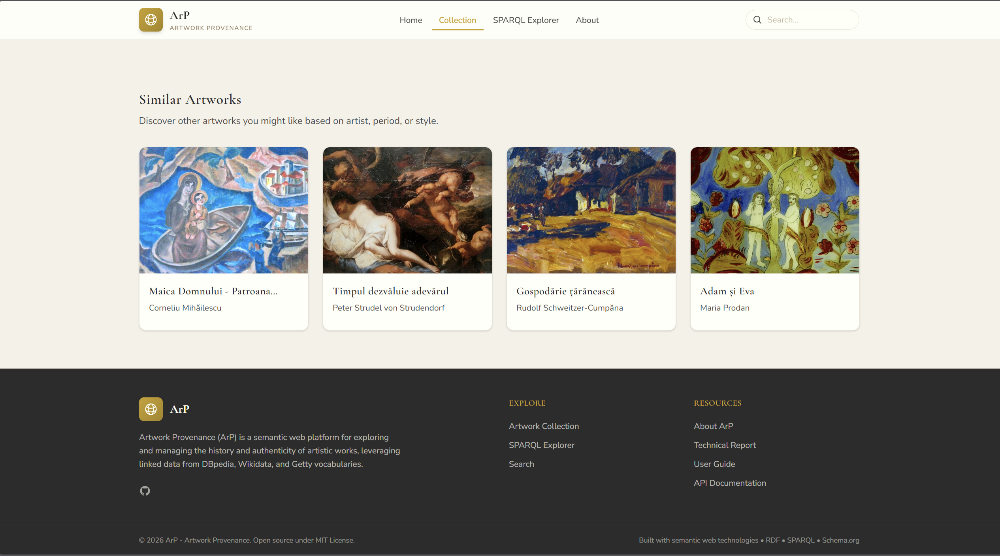
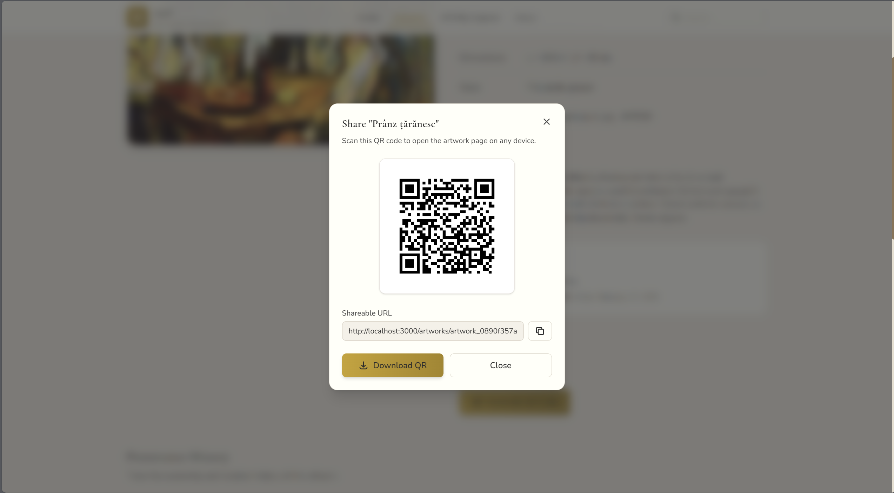
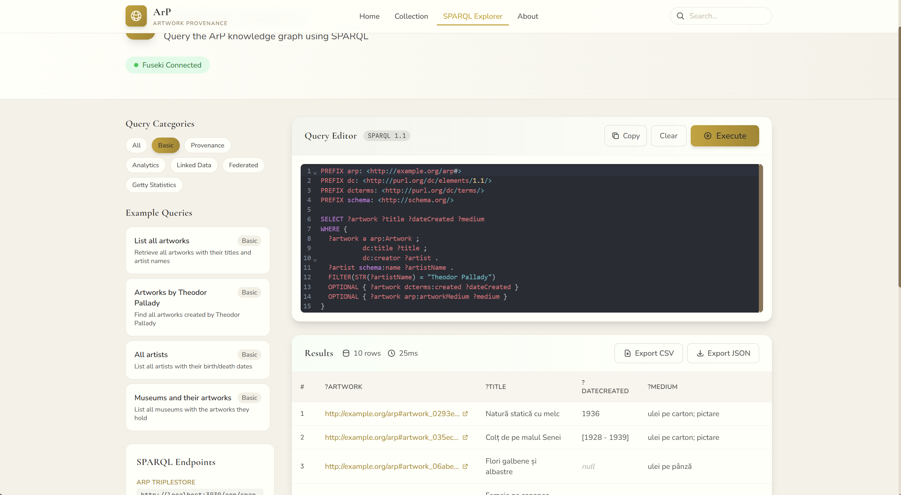

<div align="center">

  
  <h1>ArP - Artwork Provenance</h1>
  
  <p>
    A semantic web platform for exploring and managing artwork provenance using linked data and knowledge graphs!
  </p>
  

<p>
  <a href="https://github.com/MateiTiplea/PrimeProvenance-ArP/graphs/contributors">
    
  </a>
  <a href="">
    
  </a>
  <a href="https://github.com/MateiTiplea/PrimeProvenance-ArP/network/members">
    
  </a>
  <a href="https://github.com/MateiTiplea/PrimeProvenance-ArP/stargazers">
    
  </a>
  <a href="https://github.com/MateiTiplea/PrimeProvenance-ArP/issues/">
    
  </a>
  <a href="LICENSE">
    
  </a>
</p>
   
<h4>
    <a href="#camera-screenshots">View Demo</a>
  <span> · </span>
    <a href="#toolbox-getting-started">Documentation</a>
  <span> · </span>
    <a href="https://github.com/MateiTiplea/PrimeProvenance-ArP/issues/">Report Bug</a>
  <span> · </span>
    <a href="https://github.com/MateiTiplea/PrimeProvenance-ArP/issues/">Request Feature</a>
  </h4>
</div>

<br />

# :notebook_with_decorative_cover: Table of Contents

- [About the Project](#star2-about-the-project)
  * [Screenshots](#camera-screenshots)
  * [Tech Stack](#space_invader-tech-stack)
  * [Features](#dart-features)
- [Getting Started](#toolbox-getting-started)
  * [Prerequisites](#bangbang-prerequisites)
  * [Installation](#gear-installation)
  * [Run Locally](#running-run-locally)
  * [Deployment](#triangular_flag_on_post-deployment)
- [Usage](#eyes-usage)
- [Roadmap](#compass-roadmap)
- [Contributing](#wave-contributing)
- [FAQ](#grey_question-faq)
- [License](#warning-license)
- [Deliverables](#package-deliverables)
- [Contact](#handshake-contact)
- [Acknowledgements](#gem-acknowledgements)

  

## :star2: About the Project

**ArP (Artwork Provenance)** is a semantic web platform engineered to model and explore the provenance of artistic works. It uses a custom RDF ontology and Apache Jena Fuseki to provide a powerful SPARQL endpoint. The platform integrates with DBpedia, Wikidata, and Getty vocabularies to enrich artwork data with linked open data, enabling complex semantic queries and intelligent recommendations.

The system features a modern React frontend with an elegant museum-inspired design, showcasing Romanian national heritage artworks from CIMEC alongside famous international masterpieces.

### :camera: Screenshots

<div align="center"> 
  
  <p><em>Search Page - Browse and filter artworks by style, artist, and more</em></p>
</div>

<br />

<div align="center"> 
  
  <p><em>Artwork Detail - Comprehensive artwork information with provenance timeline</em></p>
</div>

<br />

<div align="center"> 
  
  <p><em>Provenance Timeline - Visual history of artwork ownership and transfers</em></p>
</div>

<br />

<div align="center"> 
  
  <p><em>Similar Artworks - Smart recommendations based on style, artist, and period</em></p>
</div>

<br />

<div align="center"> 
  
  <p><em>QR Code Sharing - Easily share and access artwork details on mobile devices</em></p>
</div>

<br />

<div align="center"> 
  
  <p><em>SPARQL Explorer - Query the knowledge graph directly</em></p>
</div>


### :space_invader: Tech Stack

<details>
  <summary>Frontend</summary>
  <ul>
    <li><a href="https://reactjs.org/">React 18</a></li>
    <li><a href="https://vitejs.dev/">Vite</a></li>
    <li><a href="https://tailwindcss.com/">Tailwind CSS</a></li>
    <li><a href="https://reactrouter.com/">React Router</a></li>
    <li><a href="https://axios-http.com/">Axios</a></li>
  </ul>
</details>

<details>
  <summary>Backend</summary>
  <ul>
    <li><a href="https://fastapi.tiangolo.com/">FastAPI</a></li>
    <li><a href="https://www.python.org/">Python 3.11+</a></li>
    <li><a href="https://rdflib.readthedocs.io/">RDFLib</a></li>
    <li><a href="https://rdflib.github.io/sparqlwrapper/">SPARQLWrapper</a></li>
    <li><a href="https://docs.pydantic.dev/">Pydantic</a></li>
  </ul>
</details>

<details>
  <summary>Database</summary>
  <ul>
    <li><a href="https://jena.apache.org/documentation/fuseki2/">Apache Jena Fuseki</a></li>
    <li><a href="https://www.w3.org/TR/sparql11-query/">SPARQL 1.1</a></li>
    <li><a href="https://www.w3.org/TR/rdf11-primer/">RDF/Turtle</a></li>
  </ul>
</details>

<details>
  <summary>DevOps</summary>
  <ul>
    <li><a href="https://www.docker.com/">Docker</a></li>
    <li><a href="https://docs.docker.com/compose/">Docker Compose</a></li>
  </ul>
</details>

### :dart: Features

- **Semantic Querying**: Advanced SPARQL integration for deep data retrieval from the knowledge graph.
- **Provenance Tracking**: Visual timeline of artwork ownership, transfers, and historical events.
- **External Enrichment**: Automatic integration with DBpedia, Wikidata, and Getty AAT vocabularies.
- **Smart Recommendations**: Content-based artwork recommendations by artist, period, and style.
- **Faceted Search**: Filter artworks by style, artist, medium, and location.
- **SPARQL Explorer**: Direct query interface with example queries and syntax highlighting.
- **QR Code Sharing**: Generate QR codes for easy artwork sharing.
- **RESTful API**: Clean, documented API endpoints with Swagger UI.
- **5-Star Linked Data**: Compliant with Tim Berners-Lee's 5-star open data principles.

## :toolbox: Getting Started

### :bangbang: Prerequisites

This project uses Docker for easy deployment.

* Docker
  ```bash
  docker --version
  ```
* Docker Compose
  ```bash
  docker compose version
  ```

For local development without Docker:
* Python 3.11+
* Node.js 18+
* npm

### :gear: Installation

1. **Clone the project**

```bash
  git clone https://github.com/MateiTiplea/PrimeProvenance-ArP.git
  cd PrimeProvenance-ArP
```

2. **Install Backend Dependencies** (for local development)

```bash
  cd backend
  python -m venv .venv
  # Windows
  .venv\Scripts\activate
  # Linux/Mac
  source .venv/bin/activate
  
  pip install -r requirements.txt
```

3. **Install Frontend Dependencies** (for local development)

```bash
  cd ../frontend
  npm install
```
   
### :running: Run Locally

**Using Docker (Recommended)**

```bash
  docker-compose up -d --build
```

The services will be available at:
- **Frontend**: http://localhost:3000
- **Backend API**: http://localhost:8000
- **API Documentation**: http://localhost:8000/docs
- **SPARQL Endpoint**: http://localhost:3030

### :triangular_flag_on_post: Deployment

To deploy the entire stack using Docker Compose:

```bash
  docker-compose up -d --build
```


## :eyes: Usage

- **Web Interface**: Go to `http://localhost:3000` to browse artworks, explore provenance, and discover connections.
- **API Docs**: Visit `http://localhost:8000/docs` to interact with the Swagger UI.
- **SPARQL Endpoint**: Query the Fuseki server directly at `http://localhost:3030/arp/sparql`.


## :compass: Roadmap

* [x] Project Setup & Architecture Design
* [x] Core RDF Ontology (ArP Ontology)
* [x] Apache Jena Fuseki Integration
* [x] FastAPI Backend Implementation
* [x] React Frontend with Tailwind CSS
* [x] Artwork CRUD Operations
* [x] Provenance Event Management
* [x] SPARQL Explorer Interface
* [x] DBpedia & Wikidata Integration
* [x] Getty AAT Vocabulary Lookups
* [x] Romanian Heritage Data Import (CIMEC)
* [x] Content-Based Recommendations
* [x] Faceted Search & Filtering
* [x] QR Code Generation
* [x] Technical Report (Scholarly HTML)

## :wave: Contributing

<a href="https://github.com/MateiTiplea/PrimeProvenance-ArP/graphs/contributors">
  
</a>


Contributions are always welcome!

1. Fork the repository
2. Create a new branch (`git checkout -b feature/amazing-feature`)
3. Commit your changes (`git commit -m 'Add some amazing feature'`)
4. Push to the branch (`git push origin feature/amazing-feature`)
5. Open a Pull Request


## :grey_question: FAQ

- **How do I reset the database?**

  + Stop the containers, delete the `fuseki/fuseki_data` folder, and restart with `docker-compose up -d --build`.

- **Where is the ontology file?**

  + It is located in `fuseki/data/arp-ontology.ttl`. See also `docs/ontology.md` for documentation.

- **How do I add new artworks?**

  + Use the REST API at `POST /api/artworks` or add RDF data directly to `fuseki/data/`.

- **Can I query external data sources?**

  + Yes! The platform automatically queries DBpedia, Wikidata, and Getty AAT for artwork enrichment.


## :warning: License

Distributed under the MIT License. See `LICENSE` for more information.

Content and data are distributed under [CC BY 4.0](https://creativecommons.org/licenses/by/4.0/).


## :package: Deliverables

Here you can find all the resources and documentation related to the ArP project.

### Source Code
The complete source code is hosted on GitHub:
*   [**Repository Link**](https://github.com/MateiTiplea/PrimeProvenance-ArP)

### Documentation
*   **Technical Report (Scholarly HTML)**: [docs/technical-report.html](frontend/public/docs/technical-report.html)
*   **Ontology Documentation**: [docs/ontology.md](docs/ontology.md)
*   **API Documentation**: [Swagger UI](http://localhost:8000/docs) *(runs locally)*
*   **OpenAPI Spec**: [docs/openapi.yaml](docs/openapi.yaml)

### Demo
*   **Video Presentation**: [YouTube Link](#) *(coming soon)*

### Data Sources
*   [CIMEC - Romanian Cultural Heritage](http://clasate.cimec.ro/)
*   [DBpedia](https://www.dbpedia.org/)
*   [Wikidata](https://www.wikidata.org/)
*   [Getty AAT](https://vocab.getty.edu/aat/)


## :handshake: Contact

Project Link: [https://github.com/MateiTiplea/PrimeProvenance-ArP](https://github.com/MateiTiplea/PrimeProvenance-ArP)


## :gem: Acknowledgements

 - [Awesome Readme Template](https://github.com/Louis3797/awesome-readme-template)
 - [WADe Course](https://profs.info.uaic.ro/sabin.buraga/teach/courses/wade/) - Web Application Development
 - [CIMEC Romanian Heritage](http://clasate.cimec.ro/)
 - [DBpedia](https://www.dbpedia.org/)
 - [Wikidata](https://www.wikidata.org/)
 - [Getty Vocabularies](https://vocab.getty.edu/)
 - [FastAPI](https://fastapi.tiangolo.com/)
 - [Apache Jena](https://jena.apache.org/)
 - [React](https://reactjs.org/)
 - [Tailwind CSS](https://tailwindcss.com/)

---

<div align="center">
  <p>Tags: <code>semantic-web</code> <code>linked-data</code> <code>rdf</code> <code>sparql</code> <code>art-history</code> <code>provenance</code> <code>wade</code> <code>infoiasi</code></p>
</div>
