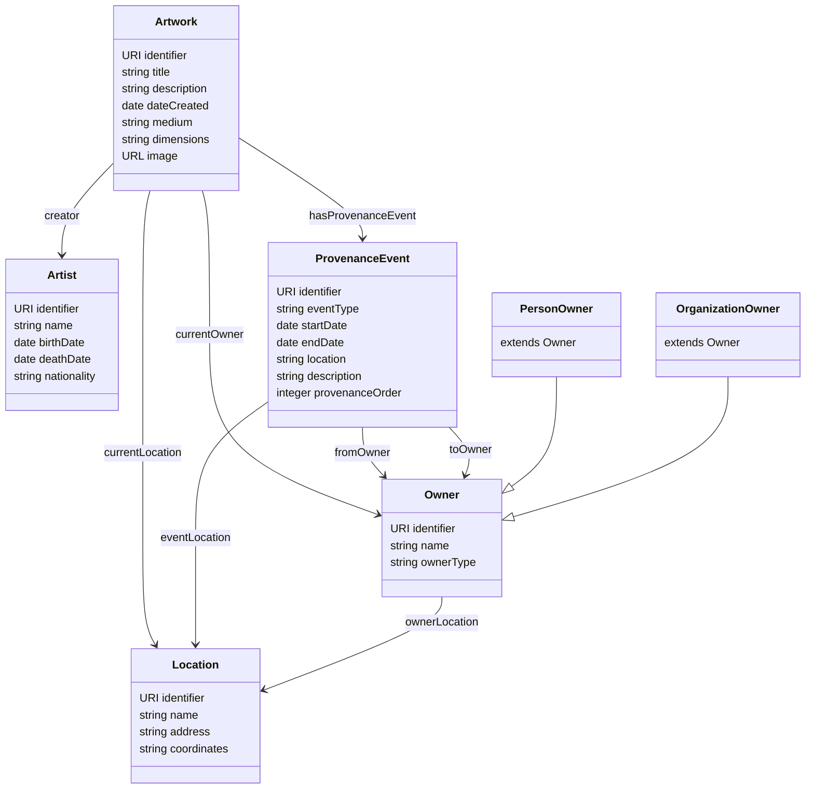

# ArP Ontology Documentation

## 1. Introduction

The ArP (Artwork Provenance) ontology defines a formal vocabulary for modeling and managing the provenance of artistic works. It enables the representation of artworks, their creators, ownership history, and related metadata using Semantic Web technologies.

### Purpose

- Model artwork metadata and provenance chains in RDF
- Enable federated queries with external knowledge bases (DBpedia, Wikidata)
- Support content negotiation (HTML, RDF, JSON-LD)
- Provide interoperability through alignment with established ontologies

### Scope

The ontology covers:
- **Artworks**: Paintings, sculptures, drawings, and other visual art forms
- **Artists**: Creators of artworks with biographical information
- **Provenance Events**: Ownership transfers, acquisitions, sales, and other historical events
- **Owners**: Individuals and organizations that have owned artworks
- **Locations**: Museums, galleries, and geographic places

## 2. Namespace Declarations

### ArP Namespace

```
@prefix arp: <http://example.org/arp#> .
```

### External Vocabularies

| Prefix | Namespace | Description |
|--------|-----------|-------------|
| `rdf` | `http://www.w3.org/1999/02/22-rdf-syntax-ns#` | RDF Core Vocabulary |
| `rdfs` | `http://www.w3.org/2000/01/rdf-schema#` | RDF Schema |
| `owl` | `http://www.w3.org/2002/07/owl#` | Web Ontology Language |
| `xsd` | `http://www.w3.org/2001/XMLSchema#` | XML Schema Datatypes |
| `dc` | `http://purl.org/dc/elements/1.1/` | Dublin Core Elements |
| `dcterms` | `http://purl.org/dc/terms/` | Dublin Core Terms |
| `prov` | `http://www.w3.org/ns/prov#` | PROV Ontology |
| `schema` | `http://schema.org/` | Schema.org Vocabulary |
| `crm` | `http://www.cidoc-crm.org/cidoc-crm/` | CIDOC-CRM |
| `aat` | `http://vocab.getty.edu/aat/` | Getty Art & Architecture Thesaurus |
| `dbr` | `http://dbpedia.org/resource/` | DBpedia Resources |
| `wd` | `http://www.wikidata.org/entity/` | Wikidata Entities |

## 3. Class Hierarchy

### Ontology Diagram



### Class Definitions

#### arp:Artwork

Represents a visual artwork such as a painting, sculpture, or drawing.

| Property | Type | Description |
|----------|------|-------------|
| `rdfs:subClassOf` | `crm:E22_Human-Made_Object`, `schema:VisualArtwork` | Parent classes |
| `dc:title` | `xsd:string` | Title of the artwork |
| `dc:description` | `xsd:string` | Description of the artwork |
| `dc:creator` | `arp:Artist` | Creator of the artwork |
| `dcterms:created` | `xsd:date` or `xsd:string` | Date or period of creation |
| `arp:artworkMedium` | `xsd:string` | Medium/technique (e.g., "Oil on canvas") |
| `arp:artworkDimensions` | `xsd:string` | Physical dimensions |
| `arp:artworkPeriod` | `xsd:string` | Art historical period |
| `arp:artworkStyle` | `xsd:string` | Artistic style |
| `schema:image` | `xsd:anyURI` | Image URL |
| `arp:currentOwner` | `arp:Owner` | Current owner |
| `arp:currentLocation` | `arp:Location` | Current location |
| `arp:hasProvenanceEvent` | `arp:ProvenanceEvent` | Provenance events |
| `owl:sameAs` | `xsd:anyURI` | Links to DBpedia/Wikidata |

#### arp:Artist

Represents a person who creates artworks.

| Property | Type | Description |
|----------|------|-------------|
| `rdfs:subClassOf` | `crm:E21_Person`, `schema:Person` | Parent classes |
| `schema:name` | `xsd:string` | Artist's name |
| `schema:birthDate` | `xsd:date` | Date of birth |
| `schema:deathDate` | `xsd:date` | Date of death |
| `schema:nationality` | `xsd:string` | Nationality |
| `schema:birthPlace` | `arp:Location` | Place of birth |
| `dc:description` | `xsd:string` | Biographical description |
| `owl:sameAs` | `xsd:anyURI` | Links to DBpedia/Wikidata |

#### arp:ProvenanceEvent

Represents an event in the ownership history of an artwork.

| Property | Type | Description |
|----------|------|-------------|
| `rdfs:subClassOf` | `prov:Activity`, `crm:E8_Acquisition` | Parent classes |
| `arp:eventType` | `xsd:string` | Type of event (Sale, Gift, etc.) |
| `prov:startedAtTime` | `xsd:date` | Start date |
| `prov:endedAtTime` | `xsd:date` | End date |
| `dc:description` | `xsd:string` | Description of the event |
| `arp:fromOwner` | `arp:Owner` | Previous owner |
| `arp:toOwner` | `arp:Owner` | New owner |
| `arp:eventLocation` | `arp:Location` | Where event occurred |
| `arp:provenanceOrder` | `xsd:integer` | Sequence number in chain |
| `arp:acquisitionMethod` | `xsd:string` | Method of acquisition |
| `arp:transactionPrice` | `xsd:decimal` | Transaction price |
| `arp:transactionCurrency` | `xsd:string` | Currency used |

#### arp:Owner

Represents a person or organization that owns or has owned an artwork.

| Property | Type | Description |
|----------|------|-------------|
| `rdfs:subClassOf` | `crm:E39_Actor` | Parent class |
| `schema:name` | `xsd:string` | Owner's name |
| `dc:description` | `xsd:string` | Description |
| `arp:ownerLocation` | `arp:Location` | Associated location |
| `owl:sameAs` | `xsd:anyURI` | Links to DBpedia/Wikidata |

**Subclasses:**
- `arp:PersonOwner` - Individual person (extends `schema:Person`)
- `arp:OrganizationOwner` - Organization/institution (extends `schema:Organization`)

#### arp:Location

Represents a geographic location.

| Property | Type | Description |
|----------|------|-------------|
| `rdfs:subClassOf` | `crm:E53_Place`, `schema:Place` | Parent classes |
| `schema:name` | `xsd:string` | Location name |
| `schema:address` | `xsd:string` | Physical address |
| `schema:geo` | `schema:GeoCoordinates` | Geographic coordinates |
| `owl:sameAs` | `xsd:anyURI` | Links to DBpedia/Wikidata |

## 4. Properties

### Object Properties

| Property | Domain | Range | Description |
|----------|--------|-------|-------------|
| `arp:hasProvenanceEvent` | `arp:Artwork` | `arp:ProvenanceEvent` | Links artwork to provenance events |
| `arp:fromOwner` | `arp:ProvenanceEvent` | `arp:Owner` | Previous owner in transfer |
| `arp:toOwner` | `arp:ProvenanceEvent` | `arp:Owner` | New owner in transfer |
| `arp:currentOwner` | `arp:Artwork` | `arp:Owner` | Current owner |
| `arp:currentLocation` | `arp:Artwork` | `arp:Location` | Current location |
| `arp:eventLocation` | `arp:ProvenanceEvent` | `arp:Location` | Event location |
| `arp:ownerLocation` | `arp:Owner` | `arp:Location` | Owner's location |

### Datatype Properties

| Property | Domain | Range | Description |
|----------|--------|-------|-------------|
| `arp:provenanceOrder` | `arp:ProvenanceEvent` | `xsd:integer` | Order in provenance chain |
| `arp:eventType` | `arp:ProvenanceEvent` | `xsd:string` | Type of event |
| `arp:acquisitionMethod` | `arp:ProvenanceEvent` | `xsd:string` | Acquisition method |
| `arp:transactionPrice` | `arp:ProvenanceEvent` | `xsd:decimal` | Price paid |
| `arp:transactionCurrency` | `arp:ProvenanceEvent` | `xsd:string` | Currency |
| `arp:artworkMedium` | `arp:Artwork` | `xsd:string` | Medium/technique |
| `arp:artworkDimensions` | `arp:Artwork` | `xsd:string` | Physical dimensions |
| `arp:artworkPeriod` | `arp:Artwork` | `xsd:string` | Historical period |
| `arp:artworkStyle` | `arp:Artwork` | `xsd:string` | Artistic style |

## 5. Usage Examples

### Example: Defining an Artwork

```turtle
@prefix arp: <http://example.org/arp#> .
@prefix dc: <http://purl.org/dc/elements/1.1/> .
@prefix dcterms: <http://purl.org/dc/terms/> .
@prefix schema: <http://schema.org/> .
@prefix dbr: <http://dbpedia.org/resource/> .

arp:artwork_mona_lisa a arp:Artwork, schema:Painting ;
    dc:title "Mona Lisa"@en ;
    dc:creator arp:artist_davinci ;
    dcterms:created "1503/1519" ;
    arp:artworkMedium "Oil on poplar panel" ;
    arp:artworkDimensions "77 cm × 53 cm" ;
    arp:artworkPeriod "High Renaissance" ;
    arp:currentLocation arp:location_louvre ;
    owl:sameAs dbr:Mona_Lisa .
```

### Example: Provenance Chain

```turtle
arp:artwork_mona_lisa arp:hasProvenanceEvent 
    arp:prov_001, arp:prov_002, arp:prov_003 .

arp:prov_001 a arp:ProvenanceEvent ;
    arp:eventType "Creation" ;
    prov:startedAtTime "1503-01-01"^^xsd:date ;
    arp:toOwner arp:artist_davinci ;
    arp:provenanceOrder 1 .

arp:prov_002 a arp:ProvenanceEvent ;
    arp:eventType "Acquisition" ;
    prov:startedAtTime "1519-01-01"^^xsd:date ;
    arp:fromOwner arp:artist_davinci ;
    arp:toOwner arp:owner_french_crown ;
    arp:provenanceOrder 2 .
```

## 6. SPARQL Query Examples

### List All Artworks with Creators

```sparql
PREFIX arp: <http://example.org/arp#>
PREFIX dc: <http://purl.org/dc/elements/1.1/>
PREFIX schema: <http://schema.org/>

SELECT ?artwork ?title ?artistName WHERE {
    ?artwork a arp:Artwork ;
             dc:title ?title ;
             dc:creator ?artist .
    ?artist schema:name ?artistName .
}
ORDER BY ?title
```

### Get Provenance Chain for an Artwork

```sparql
PREFIX arp: <http://example.org/arp#>
PREFIX dc: <http://purl.org/dc/elements/1.1/>
PREFIX prov: <http://www.w3.org/ns/prov#>
PREFIX schema: <http://schema.org/>

SELECT ?order ?eventType ?date ?fromOwnerName ?toOwnerName ?description WHERE {
    arp:artwork_mona_lisa arp:hasProvenanceEvent ?event .
    ?event arp:eventType ?eventType ;
           arp:provenanceOrder ?order .
    OPTIONAL { ?event prov:startedAtTime ?date }
    OPTIONAL { ?event dc:description ?description }
    OPTIONAL { 
        ?event arp:fromOwner ?fromOwner .
        ?fromOwner schema:name ?fromOwnerName .
    }
    OPTIONAL { 
        ?event arp:toOwner ?toOwner .
        ?toOwner schema:name ?toOwnerName .
    }
}
ORDER BY ?order
```

### Find Artworks by Period

```sparql
PREFIX arp: <http://example.org/arp#>
PREFIX dc: <http://purl.org/dc/elements/1.1/>

SELECT ?artwork ?title ?period WHERE {
    ?artwork a arp:Artwork ;
             dc:title ?title ;
             arp:artworkPeriod ?period .
    FILTER(CONTAINS(LCASE(?period), "renaissance"))
}
```

### Federated Query with DBpedia

```sparql
PREFIX arp: <http://example.org/arp#>
PREFIX dc: <http://purl.org/dc/elements/1.1/>
PREFIX owl: <http://www.w3.org/2002/07/owl#>
PREFIX dbo: <http://dbpedia.org/ontology/>

SELECT ?artwork ?title ?dbpediaAbstract WHERE {
    ?artwork a arp:Artwork ;
             dc:title ?title ;
             owl:sameAs ?dbpediaUri .
    SERVICE <https://dbpedia.org/sparql> {
        ?dbpediaUri dbo:abstract ?dbpediaAbstract .
        FILTER(LANG(?dbpediaAbstract) = "en")
    }
}
```

### Find Romanian Heritage Artworks

```sparql
PREFIX arp: <http://example.org/arp#>
PREFIX dc: <http://purl.org/dc/elements/1.1/>
PREFIX schema: <http://schema.org/>

SELECT ?artwork ?title ?artistName ?location WHERE {
    ?artwork a arp:Artwork ;
             dc:title ?title ;
             dc:creator ?artist ;
             arp:currentLocation ?loc .
    ?artist schema:name ?artistName ;
            schema:nationality "Romanian" .
    ?loc schema:name ?location .
}
```

## 7. External Vocabulary Alignment

### CIDOC-CRM Alignment

| ArP Class | CIDOC-CRM Class | Relationship |
|-----------|-----------------|--------------|
| `arp:Artwork` | `crm:E22_Human-Made_Object` | `rdfs:subClassOf` |
| `arp:Artist` | `crm:E21_Person` | `rdfs:subClassOf` |
| `arp:ProvenanceEvent` | `crm:E8_Acquisition` | `rdfs:subClassOf` |
| `arp:Owner` | `crm:E39_Actor` | `rdfs:subClassOf` |
| `arp:Location` | `crm:E53_Place` | `rdfs:subClassOf` |

### PROV-O Alignment

| ArP Class/Property | PROV-O Class/Property | Relationship |
|--------------------|-----------------------|--------------|
| `arp:ProvenanceEvent` | `prov:Activity` | `rdfs:subClassOf` |
| `arp:eventLocation` | `prov:atLocation` | `rdfs:subPropertyOf` |
| `arp:fromOwner` | `prov:wasAssociatedWith` | `rdfs:subPropertyOf` |
| `arp:toOwner` | `prov:wasAssociatedWith` | `rdfs:subPropertyOf` |

### Schema.org Alignment

| ArP Class | Schema.org Class | Relationship |
|-----------|------------------|--------------|
| `arp:Artwork` | `schema:VisualArtwork` | `rdfs:subClassOf` |
| `arp:Artist` | `schema:Person` | `rdfs:subClassOf` |
| `arp:PersonOwner` | `schema:Person` | `rdfs:subClassOf` |
| `arp:OrganizationOwner` | `schema:Organization` | `rdfs:subClassOf` |
| `arp:Location` | `schema:Place` | `rdfs:subClassOf` |

### Getty AAT Integration

The ontology references Getty Art & Architecture Thesaurus (AAT) terms for standardized art vocabulary:

```turtle
schema:artMedium aat:300015050 .  # Oil paint
schema:artMedium aat:300015062 .  # Tempera
```

## 8. File Locations

| File | Path | Description |
|------|------|-------------|
| Ontology Definition | [`fuseki/data/arp-ontology.ttl`](../fuseki/data/arp-ontology.ttl) | OWL/RDF ontology |
| Sample Data | [`fuseki/data/sample-data.ttl`](../fuseki/data/sample-data.ttl) | Example artworks |
| Fuseki Config | [`fuseki/config/config.ttl`](../fuseki/config/config.ttl) | TDB2 dataset configuration |

## 9. Linked Data Principles

The ArP ontology follows the four Linked Data principles:

1. **Use URIs as names for things** - All resources have unique URIs (e.g., `arp:artwork_mona_lisa`)

2. **Use HTTP URIs** - URIs are dereferenceable (when deployed)

3. **Provide useful information using standards** - RDF, SPARQL, and standard vocabularies

4. **Include links to other URIs** - `owl:sameAs` links to DBpedia and Wikidata

## 10. Version History

| Version | Date | Changes |
|---------|------|---------|
| 1.0.0 | 2026-01-04 | Initial release |

